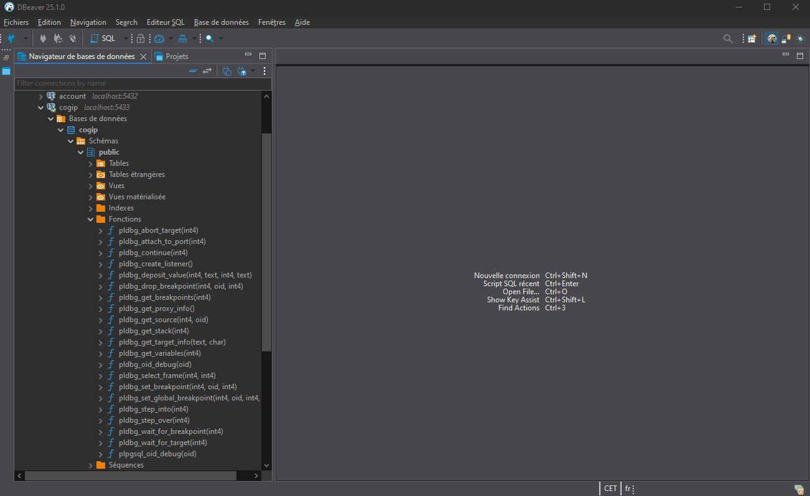
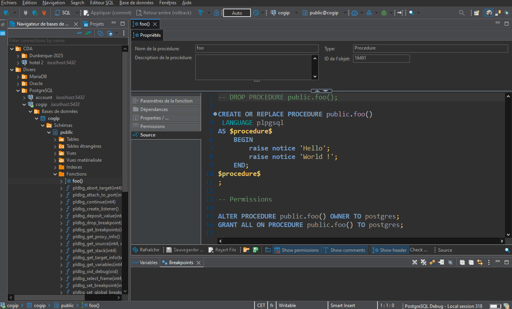

# Base de données "cogip"

Ce dépôt contient les exercices de requêtage portant sur la base de données "cogip" utilisée en formation à l'Afpa.

Vous y retrouverez :
- les fichiers de configuration Docker ;
- les scripts de création de base de données.

Compétences abordées :
- mise en place d'une base de données en utilisant Docker ;
- développement de fonctions/procédures stockées en plpgsql ;
- développement de trigger.

> [!IMPORTANT]
> Vous allez apprendre à écrire du **code procédural** au sein d'une base de données.
> Pour une base Postgres vous allez pouvoir utiliser le langage **PL/pgSQL**.
>
> Un excellent cours de **PL/pgSQL** est disponible à l'[adresse suivante](https://public.dalibo.com/exports/formation/manuels/modules/p1/p1.handout.html).

## Déploiement de la base de données Docker

Le fichier "docker-compose.yml" va permettre d'instancier un conteneur Postgres accessible via le réseau local :

Pour instancier le container, exécuter la commande suivante :
```bash
docker compose -d
```

Veillez à faire attention au **conflits de ports** (notamment avec les services pré-installés en local) et modifiez la redirection de port en fonction.

## Acccès à la BDD

Utilisateur super admin (attention !) : **postgres**

Mot de passe : **supersecuredpassword**

Vous pouvez également vous connecter en utilisant un client de BDD tel que :
- [DBeaver](https://dbeaver.io/) -> pour l'installation avec [winget](https://winget.run/pkg/dbeaver/dbeaver)
- [MySQL Workbench](https://dev.mysql.com/downloads/workbench/)

## Utilisation du debugger

Comme énoncé précedemment, vous allez pouvoir développement en utilisant du **code procédural** pour une base de données.

Ceci a plusieurs intérêt :
- ajout de structures de contrôle au langage SQL (if/boucle...)
- code dédié et optimisé pour le traitement des données et au SQL
- permet d'effectuer des traitements complexes sur les données
- permet de mettre en place des mécanismes d'intégrité des données

Comme tout code procédural il est important de pouvoir utiliser un débugger afin de simplifier le développement (utilisation de point d'arrêt, observation des variables...).

### Installation l'extension de debug dans le conteneur

Le fichier de configuration `docker-compose.yml` lance la construction d'une nouvelle image basé sur le fichier `Dockerfile` contenu dans le sous-dossier `config`.

Ce fichier Dockerfile est utilisé lors de la composition effectue plusieurs commande `RUN` (pour rappel : `RUN` permet d'effectuer des commandes à la construction de l'image).

Ces commandes permettent de :
- mettre à jour l'ensemble des paquets du conteneur ;
- installer les extensions de debuggage
- mettre le SGBD en français

> [!NOTE]
> Vous pouvez vous référer aux commentaires contenus dans le fichier `Dockerfile` pour en apprendre plus sur ce qui se fait lors de la construction de l'image.

### Activation des outils de débogage sur DBeaver

Deux choses sont à faire sur DBeaver : 
1. installer les outils de debuggage de DBeaver


2. ajouter l'extension `pldbgapi`


### Création d'un fonction

La création d'une **fonction/procédure** peut se faire via l'utilisation de DBeaver comme présenté ci-dessous :



### Ajout de point d'arrêt et activation du débogage




